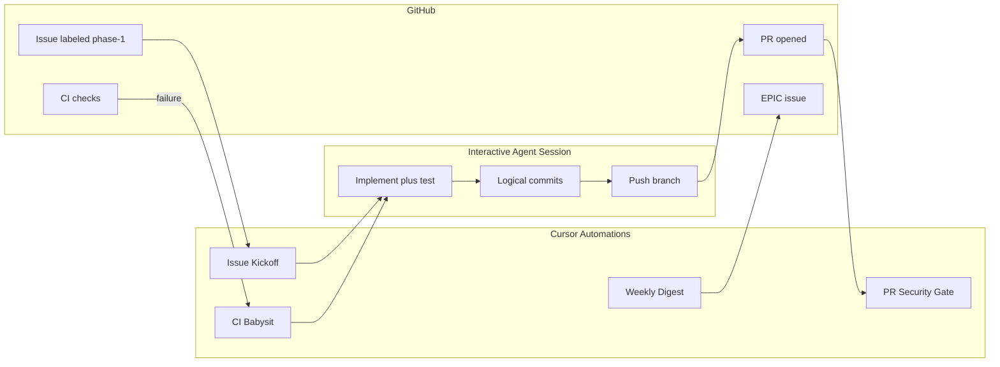

# Repo Review — Cursor Automations (A1–A4)

Orchestration for the [Repo Review Remediation EPIC](https://github.com/CloudbrokerAz/mac-speech-to-text/issues) workflow. Automations **do not** replace human merge approval or interactive implementation.

**Source report:** [`docs/repo-review/index.html`](index.html)

**Setup skill:** Cursor [`automate`](file:///Users/aarone/.cursor/skills-cursor/automate/SKILL.md) skill (`open_automation` handoff) in the **Agents Window**.

---

## Prerequisites

1. **Committed references** — Automations may only `@`-mention files on the branch they checkout:
   - `docs/repo-review/index.html`
   - `AGENTS.md` and `.claude/references/*`
   - `scripts/create-repo-review-issues.sh`
   - This file (`docs/repo-review/automations.md`)
2. **GitHub** — `gh auth status` for `CloudbrokerAz/mac-speech-to-text`.
3. **Cloud Agent compute** — Enable in [Cursor Cloud Agents dashboard](https://cursor.com/dashboard?tab=cloud-agents) for PR-triggered review runs.

### Labels (A1 trigger)

| Label | Purpose |
|-------|---------|
| `repo-review` | All 70 finding issues |
| `phase-1` / `backlog` | Work sequencing |
| `severity:critical` … `severity:low` | Severity |
| `in-progress` | Optional; A1 sets, cleared on PR merge |

---

## Automation overview

| # | Name | Trigger | Purpose |
|---|------|---------|---------|
| A1 | **Repo Review — Issue Kickoff** | GitHub: issue labeled `repo-review` + `phase-1` (or comment `/repo-review start`) | Pick up finding, post checkpoint (a), propose branch + test plan |
| A2 | **Repo Review — PR Security Gate** | GitHub: PR opened on branch `repo-review/*` | Three security-review passes; structured PR comment; fail check on blockers |
| A3 | **Repo Review — CI Babysit** | GitHub: checks completed (failure) on `repo-review/*` → `main` PRs | Triage CI, suggest fix, comment on PR + linked issue |
| A4 | **Repo Review — Weekly EPIC Digest** | Cron weekdays 09:00 (`0 9 * * 1-5`) | EPIC progress, open phase-1 count, stalled issues (>7d) |

---

## A1 — Issue Kickoff

| Field | Value |
|-------|-------|
| **Name** | Repo Review — Issue Kickoff |
| **Trigger** | GitHub issue event — label added: `phase-1` on `CloudbrokerAz/mac-speech-to-text` (issue should also have `repo-review`) |
| **Alternate trigger** | Issue comment `/repo-review start` |
| **Tools** | Comment on issues/PRs; GitHub MCP or shell `gh` |
| **Model** | Opus (or highest available for security work) |
| **Memory** | Enabled — wave order and pairings (CON-1+CON-2, TST-1+TST-2, SEC-3 before SEC-1) |

### Instructions (A1 — wave triage)

1. Read `@AGENTS.md` Topic Router.
2. Parse finding ID from issue title (`[SEC-1] …`).
3. Load matching row from `@docs/repo-review/index.html` (`FINDINGS` array).
4. Run `gh issue view` for current state.
5. Post **checkpoint (a)** comment:
   - Plan summary (evidence + fix, no PHI echo)
   - Branch name: `repo-review/<id>-<short-slug>`
   - Topic refs to load from `.claude/references/`
   - Test strategy per change type
6. Add label `in-progress` if not present.
7. **Do not push code** — hand off to interactive session for implementation.

---

## A2 — PR Security Gate

| Field | Value |
|-------|-------|
| **Name** | Repo Review — PR Security Gate |
| **Trigger** | Pull request opened; repo `CloudbrokerAz/mac-speech-to-text`; head branch prefix `repo-review/` |
| **Tools** | Comment on PRs; manage check runs (optional: `security-review-pending`) |
| **Finish in editor** | Branch filter `repo-review/**`, check-run permissions |

### Instructions (A2 — PR security gate)

Run **three** readonly security reviews on **branch changes**:

1. General security review (injection, secrets, TLS, logging).
2. **PHI regression** — `@.claude/references/phi-handling.md`; no transcript/SOAP/patient data in logs, pasteboard, audit, fixtures.
3. **Silent-failure / lifecycle** — clears on quit/idle/export; no swallowed errors on security paths; Keychain discipline.

For non-PHI PRs (e.g. ARC-2): repurpose #2 for **supply-chain** (pinned hashes); #3 for **concurrency** if applicable.

Post **one** PR comment with a table: Severity | Location | Finding.

- If any **blocker**: check conclusion `failure`; list required fixes.
- If clean: check conclusion `success`.
- **Never echo PHI** in comments.

Enforces the mandatory three security agents before merge without relying on human memory.

---

## A3 — CI Babysit

| Field | Value |
|-------|-------|
| **Name** | Repo Review — CI Babysit |
| **Trigger** | GitHub checks completed — **failure** — PRs targeting `main` from `repo-review/*` |
| **Tools** | Comment on PRs; manage check runs |
| **Reference** | [`babysit`](file:///Users/aarone/.cursor/skills-cursor/babysit/SKILL.md) triage patterns |

### Instructions (A3 — CI babysit)

1. Identify failing job (swift test, swiftlint, pre-commit, codecov).
2. Read logs **structurally only** — no PHI.
3. Post fix suggestion + link to relevant test/source file.
4. If SwiftLint custom-rule failure on TST-1/TST-2 work, cite `.swiftlint.yml` context.
5. Include re-run CI guidance (e.g. empty commit or workflow re-run).
6. Cross-link the linked `repo-review` issue if present in PR body.

---

## A4 — Weekly EPIC Digest

| Field | Value |
|-------|-------|
| **Name** | Repo Review — Weekly EPIC Digest |
| **Trigger** | Cron `0 9 * * 1-5` (weekdays 09:00 — confirm timezone in editor) |
| **Tools** | GitHub MCP or `gh issue list` / `gh issue comment` |
| **Repository** | `CloudbrokerAz/mac-speech-to-text` / `main` |

### Instructions (A4 — weekly digest)

1. Find issue titled `[EPIC] Repo Review Remediation — June 2026`.
2. Count open vs closed issues with label `repo-review`.
3. List open `phase-1` items (structural titles only).
4. Flag issues with no comment activity in **7+ days**.
5. Post digest comment on EPIC (counts only; no PHI).
6. Suggest next wave from roadmap in plan / report “Start here” section.

---

## Division of labor

| Step | Automation | Interactive agent / human |
|------|------------|-------------------------|
| Issue pickup + plan | A1 | — |
| Code + tests | — | Interactive session |
| Logical commits | — | Interactive session |
| 3× security review | A2 (+ optional local pre-push) | Spot-check large diffs |
| `gh pr create` | — | Interactive session |
| CI failure triage | A3 | Agent applies fix |
| Merge + checkpoint (c) | — | Human merges; agent posts SHA |
| EPIC progress | A4 | Human ticks EPIC checkboxes |

---

## One-time setup procedure

1. Open **Agents Window** in Cursor.
2. Run `/automate` (automate skill) for each of A1–A4.
3. Review draft → approve → open Automations editor.
4. Finish deferred picker values (branch filters, label names, cron timezone).
5. Complete smoke tests below.
6. Record automation IDs/names in this file if the editor exposes them.

---

## Smoke-test checklist

Record date, operator, and pass/fail for each run.

| # | Test | Steps | Expected | Pass? | Date | Notes |
|---|------|-------|----------|-------|------|-------|
| A1 | Issue kickoff | Add `phase-1` to a test `repo-review` issue (or comment `/repo-review start`) | Checkpoint **(a)** comment: plan, branch `repo-review/<id>-<slug>`, topic refs, test strategy; no code push | ☐ | | |
| A2 | PR security gate | Open draft PR from `repo-review/test-*` | Single PR comment with review table; check run success/failure matches blockers | ☐ | | |
| A3 | CI babysit | Intentionally break a test on a `repo-review/*` PR; wait for failed CI | Triage comment on PR with job name + fix hint; no PHI in comment | ☐ | | |
| A4 | EPIC digest | Manual run from Automations editor | Comment on EPIC with open/closed counts, open phase-1 list, stalled >7d flags | ☐ | | |

**Sign-off:** All four smoke tests passed before treating automations as production-ready.

---

## Related docs

- Remediation workflow: `.cursor/plans/repo_review_remediation_*.plan.md` (local)
- [`AGENTS.md`](../../AGENTS.md) — Topic Router, PHI rules, review pipeline
- Issue factory: [`scripts/create-repo-review-issues.sh`](../../scripts/create-repo-review-issues.sh)
